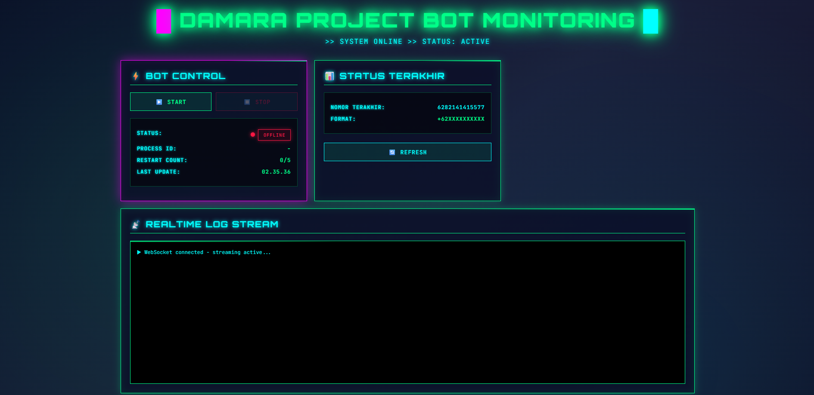

# WhatsApp Business Automation

Automated bulk messaging system for WhatsApp Web using Selenium. Designed for business promotional campaigns with anti-detection features.

## ⚠️ Disclaimer

**FOR EDUCATIONAL PURPOSES ONLY**

- This tool violates WhatsApp Terms of Service
- Your account may be banned or restricted
- Use at your own risk
- The author is not responsible for any misuse or consequences

## ✨ Features

- 🤖 **Automated Messaging** - Send bulk messages with images via WhatsApp Web
- 🔄 **Random User-Agent** - Rotate browser fingerprints to avoid detection
- ⏱️ **Human-like Typing** - Variable typing speed (0.02-0.08s per character)
- 🕐 **Smart Delays** - Random 30-60 second intervals between messages
- 🔍 **Duplicate Detection** - Auto-skip numbers with existing chat history
- 📋 **Log System** - Track sent messages to prevent re-sending
- 🌐 **Proxy Support** - Optional proxy rotation (requires setup)
- 🎯 **Retry Logic** - 3 attempts per number with error handling
- 📸 **Image Support** - Send promotional images via clipboard paste
- 🧩 **Dashboard Control** - Start/stop bot, realtime logs, status, last number
- 🎨 **Barcode Generator** - Create QR codes with optional logo overlay

## 📋 Requirements

```bash
Python 3.8+
Google Chrome Browser
```

## 🚀 Installation

1. Clone the repository:
```bash
git clone https://github.com/YOUR_USERNAME/whatsapp-business-automation.git
cd whatsapp-business-automation
```

2. Install dependencies:
```bash
pip install selenium webdriver-manager Pillow pywin32
```

3. Prepare your files:
   - `nomor.txt` - Phone numbers (one per line, format: 6281234567890)
    - `promosi1.txt` ... `promosi5.txt` - Message variants (3-5 files)
   - `barcode.jpg` - Image to send (optional)

## 📖 Usage

Run the script:
```bash
python script.py
```

First run:
1. Chrome will open WhatsApp Web
2. Scan QR code with your phone
3. Wait 45 seconds for sync
4. Script will start sending automatically

## ⚙️ Configuration

Edit these variables in `script.py`:

```python
# Delay between messages (seconds)
JEDA_MIN = 30  # Minimum delay
JEDA_MAX = 60  # Maximum delay

# Proxy settings (optional)
PROXY_ENABLED = False
PROXY_LIST = [
    # "http://proxy1:8080",
]
```

## 📂 File Structure

```
.
├── script.py              # Main automation script
├── nomor.txt              # Phone numbers (not included)
├── promosi1.txt           # Message text variants (not included)
├── promosi2.txt
├── promosi3.txt
├── promosi4.txt
├── promosi5.txt
├── barcode.jpg            # Image to send (not included)
├── log_terkirim.txt       # Sent numbers log
├── whatsapp_profile/      # Chrome profile data
├── DASHBOARD/             # FastAPI dashboard
│   ├── app.py
│   ├── bot_manager.py
│   ├── barcode_generator.py
│   ├── requirements.txt
│   └── static/index.html
├── docs/screenshots/      # Screenshot assets
└── README.md              # This file
```

## 🧭 Dashboard (FastAPI)

Control bot dari browser (start/stop/status/log realtime) dan generate barcode.

```bash
cd DASHBOARD
pip install -r requirements.txt
python app.py
```

Open:
- Local: http://127.0.0.1:8000
- Ngrok: `ngrok http 8000`

### 📸 Dashboard Screenshot

Add your screenshot here:



## 🛡️ Anti-Detection Features

1. **Random User-Agent** - 5 different browser signatures
2. **Human-like Typing** - Character-by-character with random delays
3. **Smart Intervals** - 30-60s random delays between messages
4. **Chat History Check** - Skip numbers with existing messages
5. **Session Persistence** - Reuses WhatsApp Web session

## 🔧 Troubleshooting

**Chrome won't open:**
```bash
pip install --upgrade webdriver-manager
```

**"Search box not found":**
- Google Maps structure changed
- Check for popup consent dialogs
- Increase wait times

**Messages not sending:**
- Verify phone number format (62xxx, not 08xxx)
- Check XPaths (may change after WhatsApp updates)
- Ensure image file exists

## 📊 Scraper Tool

Includes `salon_scraper2.py` for scraping business phone numbers from Google Maps:

```bash
python salon_scraper2.py
```

Configure keywords in script:
```python
KATA_KUNCI_LIST = [
    "VAPESTORE KOTA SURABAYA",
    "VAPESTORE KOTA MALANG",
]
PROVINSI = "JAWA TIMUR"
```

## ⚖️ Legal Notice

This tool is provided as-is for educational purposes. Bulk messaging violates:
- WhatsApp Terms of Service
- Anti-spam regulations in many countries
- Consumer protection laws

**Recommended alternatives:**
- WhatsApp Business API (official, paid)
- SMS marketing services
- Email marketing platforms

## 🤝 Contributing

Pull requests are welcome for:
- Bug fixes
- Performance improvements
- Documentation updates

Please do not submit PRs that:
- Remove anti-detection delays
- Encourage ToS violations
- Add malicious features

## 📝 License

MIT License - See LICENSE file for details

## 🔗 Links

- [WhatsApp Business API](https://business.whatsapp.com/products/business-api)
- [Selenium Documentation](https://www.selenium.dev/documentation/)
- [WhatsApp Terms of Service](https://www.whatsapp.com/legal/terms-of-service)

---

**Remember:** Use responsibly. Your account, your responsibility.
